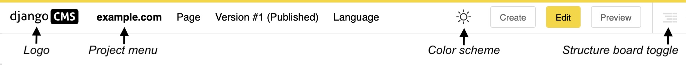
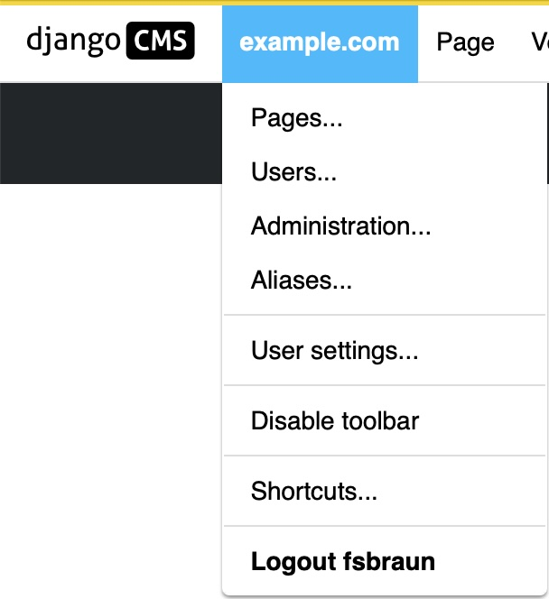
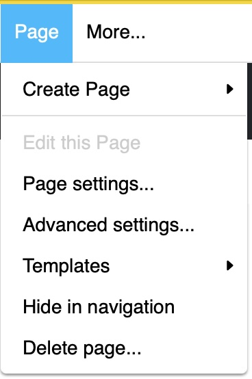
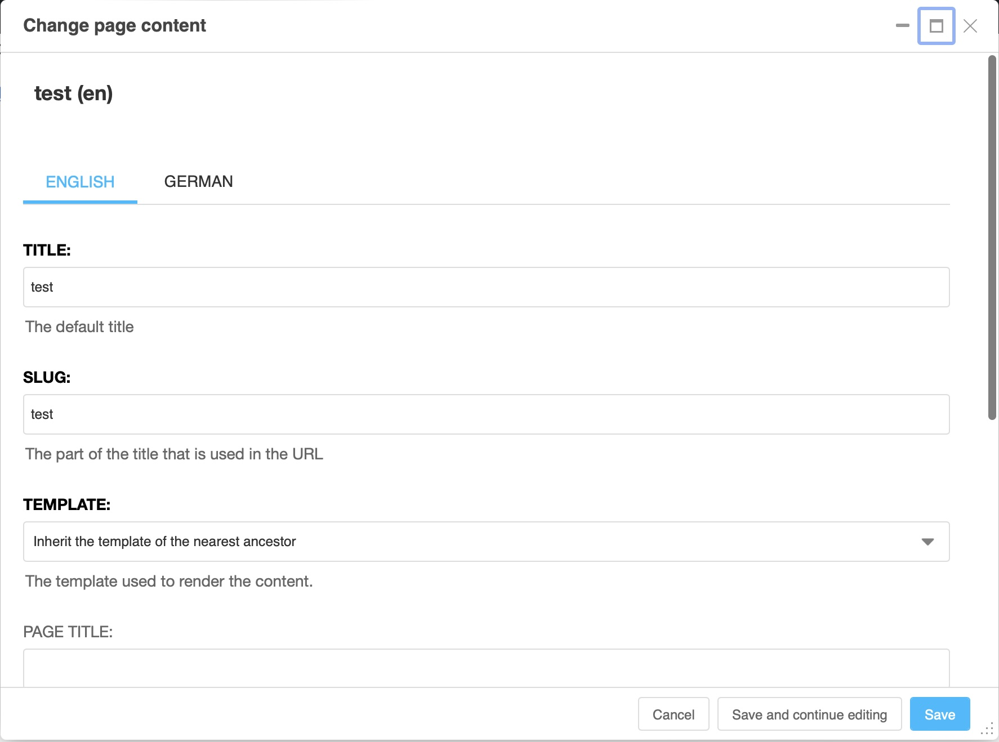
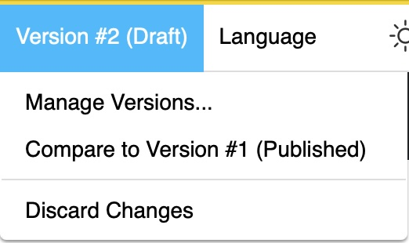
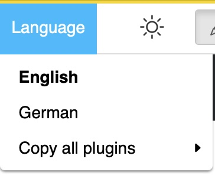

.. _toolbar:

The toolbar
###########

Overview
========

When connected to your site, the Django CMS toolbar appears. It can also be called a menu bar since it offers you several menus performing various actions.

Depending on the modules present on your site and the page you are on, you can find various elements. The only ones that will always be present are "Project", "Page" and "Language". The other proposals that may appear depend on the CMS modules present on your website and where you are located. For example, "Blog" will only be displayed if you have this module and you are on your blog page or article pages.

Another element that is constantly present in your toolbar: the django CMS logo. If you click on it, it will simply take you back to your home page.

To the right of the logo follows the project menu, the page menu and potentially some more menus: Here the version and language menu. The language menu will be missing in single-language configurations.

On the right handside you see the color scheme toggle which you can use to switch the color scheme of django CMS interface elements between light and dark. It is followed by action buttons which are highly context dependent. Finally, on the right hand corner, there is the structure board toggle which might be disabled. It is central to editing content.

The Project menu
==================

This is the part of the django CMS toolbar that corresponds to your site. Normally, the name of your website is displayed instead of "example.com".

.. note::

  You might not see all of the elements described here, or even more elements. This strongly depends on your django CMS setup.

* **Pages...** - allows you to access the page tree of your site by opening the side bar.
* **Users...** - gives you access to the user management panel in the side bar.
* **Administration...** - Allows you to manage various features via the administration window.
* **Aliases...** - Allows you to access content elements which are re-used within your sites, such as footers or announcements.
* **User settings** - Allows you to change the language of the administrator interface and the menu/toolbar.
* **Disable Toolbar** - allows you to completely disable the toolbar and the front-end editor, regardless of the login and status of the person logged in.
* **Shortcuts** - gives access to your shortcuts.
* **Logout <username>** - the user will be logged out.

Generally, by choosing one of the items of this menu, the content will be displayed in the sidebar overlay or in a new page. In the case of the sidebar, you can close it with the cross at the top right.

.. note::

  If you disable the toolbar, you can only make it reappear by adding ``?toolbar_on`` to the end of the URL in your browser window.

The "Page" menu
===============

The "Page" menu allows you to perform the following actions:

* **Create new pages** - you have the choice to create a new page, a new sub-page or to duplicate the page you are on.

  .. note::

    A parent page is a page that contains a group of several other pages of which your page is part.

    A sibling page is a page of the same level as your current page: they belong to the same group. Sibling pages either have both no parents or the same parent page.

    A sub page is a page nested within the parent page group. A parent page is the "parent" of the sub page which if also called child page.

    This is called page inheritance.and explained in more detail in the `section on the tree structure <pagetree>`_ of your site later in this document.

* **Edit this page** - allows you to edit the page you are on. Changes to a page are only possible if your are in edit mode.
* **Page settings…** - gives you access to the settings of the current page.
* **Advanced settings** - allows you to access the advanced settings of the page. Amongst the advanced settings of a page are their permissions.
* **Templates** - allows you to choose the template of your page. You can also choose to have your page inherit the template of the "closest parent", i.e. apply the template of its parent or sister page.
* **Hide/show in navigation** - toggles if the page should appear in the sites navigation
* **Delete page** - deletes the page.

Page settings
-------------

The screenshot below give you a quick overview of the basic settings dialogs for your page.

We will see them in more detail when we create your page, but here are some important information:

* **Title:** field dedicated to the title of your page that you enter when creating your page.
* **Slug:** automatically generated, it is what appears at the end of the URL.

You will probably not use the advanced settings because they are mainly used for redirects.

Note that the page settings are available seperately for all languages of the page. Use the language tabs to navigate between settings in different languages.

The version menu
================

The version menu allows you to manage current and past versions of the page you are viewing. The menu title includes the version number of the current page (counted by language) and its status:
* Draft: The copy you are currently editing
* Published: The version that currently is publicly visible.
* Unpublished: Any version that once was publicly visible but now is not any more.
* Archived: Any draft version that has been archived for later use.

You can perform the following actions:

* **Manage versions...** - get a list of all versions of this page in the sidebar.
* **Compare to version <x>...** - get a visual comparison on how the currently viewed version differs from any other version of the pasge. Difference are highlighted by colors either on the page or the page's source code.
* **Discard Changes** - makes all changes of the current draft undone

The language menu
=================

The "Language" menu allows you to switch between the different language versions on the page you are viewing, and to manage the different translations.

You can add a missing translation, delete an existing one or copy all plugins and their content from an existing translation to the current one.

The action buttons
==================

On the right hand side are the action buttons.

* The **Create** button opens up the content creation wizard which allows you to easily create a new page or potentially other content elements installed at your site.
* The **Edit** button to open the page to make changes in editing mode, (appearance of the structure menu & possibility to double-click to modify the content),
* The **New Draft** button to create a new draft copy of the page end open it in edit mode.
* The **Preview** button switches to the preview mode. Here, no changes are possible. Also works for non-public content, such as unpublished pages.
* The **View published** button redirects to the currently visible version of the page.
* The **Publish** button which makes the current draft the new published content. A previously published version of the page becomes unpublished.

