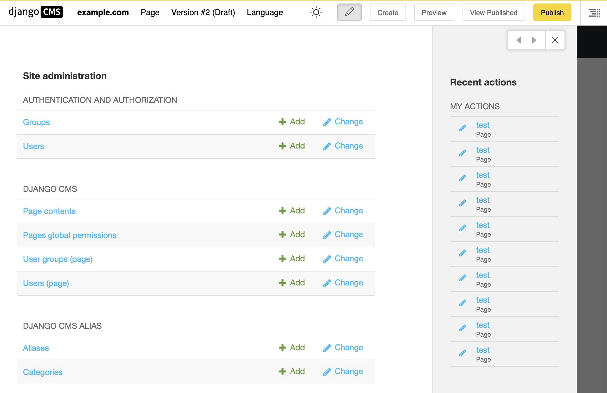

.. _sidebar:

Administration side bar
#######################

Introduction
============

When you click on "Administration" in the project menu, the administration or admin window opens. It covers most the content of your page. If you want to go back to your page, just click the close button or into the area outside the side bar. It covers the full administration interface of your site, including those added by django CMS. Depending on the modules installed on your site, its content may vary. It is identical to the content on the sites admin pages.

From this page, you can access the different administration sections of your site: management of pages, media files, users, ...

