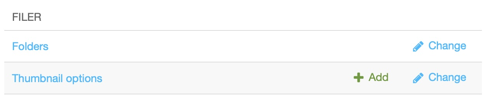

The media library
#################

The Media library allows you to access all your files, folders and images on your site. You reach the media library through the Administration menu entry in the project menu. It opens in the sidebar.

By accessing it, you will be able to modify the titles, alt tags, captions and other information of your images, and also manage your folders and files.

Access the Media library
========================
To manage the files on your site, look for the Filer section and click on "Folders":

Description of the Media library
================================

Media files live in folders just like in a regular file system.

The greyed out "Unsorted uploads" file contains all the images that do not belong to any folder and that have been directly uploaded to a CMS page or a blog post.

The blue folder "Blog" might contain all your picture folders used in your blog. You will be able to manage all the photo folders, add or delete them...

.. warning::

  Important: Before deleting a folder or an image, make sure that the contents of the folder or the image are not used on your site. If, for example, you delete an image while it is present in an article, it will disappear from this same article.

.. warning::

  Would you like to see more content here? Please `join us on Slack <https://www.django-cms.org/slack>`_ and the Slack ``#workgroup-documentation`` to add content here.
