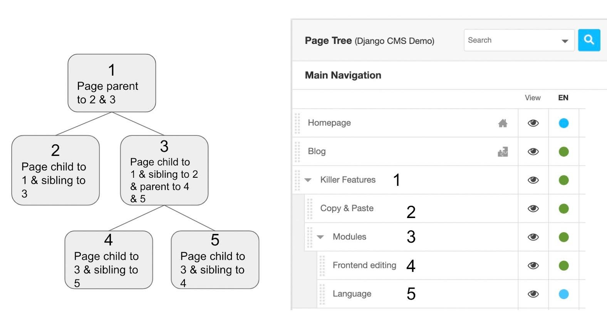
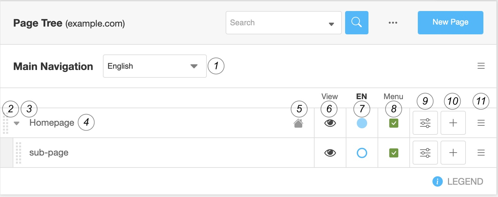
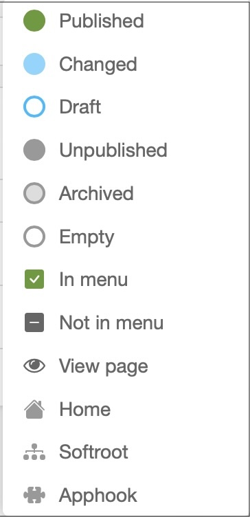

.. _pagetree:

The page tree structure
#######################

The tree structure of your site allows you to access all your pages. Many features and information are present in this part of your site. To better understand them, we suggest you look at how to access your tree structure, and understand the principles that are linked to it and its features.

See the page tree
=================

To access the tree structure of your site, go to the project menu (which has the name of your site, or "example.com" on the screenshots here), and choose "Pages...". The side bar opens and shows the complete tree structure of your site. That is to say, all the pages that make up your site: visible and non-visible, pages and sub-pages, published or not.

Alternatively, you can reach the page tree by clicking "Page contents" in the admin sidebar, which you find in the "Django CMS" section.

Principles of the parent, child and sibling pages
=================================================

This section is intended to give you a better understanding of what is meant by page inheritance and the names given to it.

The page tree structure is divided into different sections: these are the pages at different levels. Each page can be nested in another one, i.e. a page can contain several sub-pages. This page is then called the "parent page" and its sub-pages are its "child pages". A child page can also have its own child pages. The idea is to organize your site in several different levels so that it is clearer for the user.

To better understand, let us take the image of a tree as a metaphor:

* Your **home page** is the trunk, it presents all the thematic pages of your site.
* The **top-level pages** are the branches of your tree and have other small branches. We call these top-level pages "parent pages".
* The small branches correspond to the **child pages** of your top-level pages (the "parents"). Each parent page may or may not have child pages, just as the branch of a tree may or may not have smaller branches.
* The leaves of your tree represent the content of your pages or the sub-pages of your child pages, which do not have any child pages of their own.

  The page tree structure: Related pages, child and sibling pages. A small branch is composed of pages 3, 4 and 5. The leaves are in this example are pages 2, 4 and 5.

Each page is thus nested in the others when they have a common point: all your blog posts correspond to the parent page "Blog" for example. All your pages having the same the same central goal can be grouped together in a group and form the set of child pages of a parent page bearing the name of this topic. Thus, your parent page allows access to the content of your daughter pages and helps the user to better find his way around your site in relation to what he is looking for and wants to do.

As for a sibling page, it is simply a page at the same level as those around it in the tree. In a group of child pages, all pages are siblings. The same applies to parent pages.

Managing the page tree
======================

The page tree is a list of all the pages of your site. It gives you an overview of your pages and their status.

By default, the following information is displayed:

From left to right, you will find the following items:

1. The **language menu** which decides which language version of the page tree you see
2. The dotted bar on the left to **move the pages** using Drag & Drop
3. The **hide arrow**, present only in the case of a parent page. It shows or hides the page's child pages.
4. The **title of the page** in the selected language. If this says "Empty title" there is no version of that page in the selected language, yet.
5. The **root indicator** (house) indicating which page is presented at the root URL of the site. A puzzle symbol at this place indicates that the page is handled by a third-party application.
6. The **eye icon** allows you to preview the page
7. The **publication status menu** menu. Its color provides the following information:
    * **Blank**: the translation of the page into this language does not exist.
    * **White with blue border**: An unpublished draft of the page exists. There is not public version of the page.
    * **Green**: the translation exists and the page is published,
    * **Blue**: changes on the page have not been published. If you go to this page, the button at the top right will suggest you to publish the changes so that they are visible to the user.
8. **"Menu"** indicates whether the page appears in the navigation menu of your site or not,
    * Green / check: the page is visible in the navigation menu
    * Gray / unchecked: the page does not appear
9. The **settings button** opens the page settings.
10. The **add button** adds a child page.
11. The **hamburger context menu** offers additional actions:
    * Copy
    * Cut
    * Paste
    * Delete...
    * Set as home
    * Advanced settings
    * Miscellaneous information: the date of the last change, the access (restricted or not), the author of the last modifications.

At the top right is a small menu, composed of a search button allowing you to find a specific page in your tree, a "..." button to choose the site whose tree you want to see (in many installations you will only see one site), and a button to add a new page.

At the bottom right there is the legend with a complete list of all symbols used in the page tree view. Open it by clicking on the information icon:

