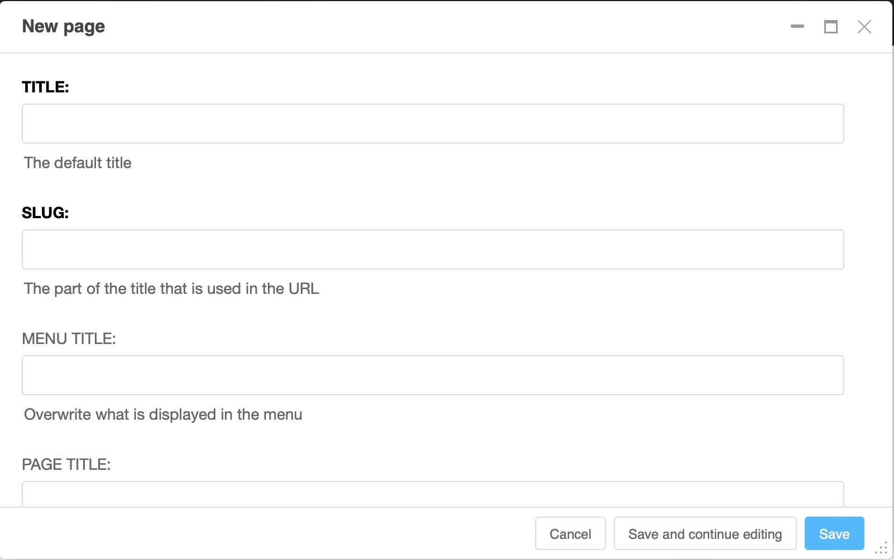
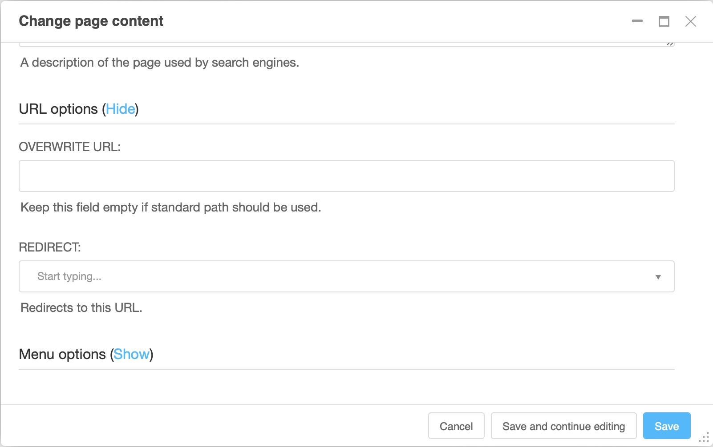

.. _content:

###########################
Creating places for content
###########################

Content needs a place to live. Typically those are  pages, but you also may have other content models, like aliases (chunks of content that are re-used elsewhere) or blog posts.

We will work with pages in this guide.

Create a page
#############

To create a new page, you have three options:

1. Go to the **project menu**, select "Pages...". The sidebar will appear. Click on the button "New page" to open the page dialog box.

2. Use the **wizard** by clicking on the "Create" button at the top right of the toolbar. The wizard dialog appears, where you can select "New page" or "New sub page"
  .. image:: ./images/06-wizard-1.jpg
    :alt: Step 1 of the wizard dialog

3. In the **"Page" menu**, select "Create a page" then "New page..." (or "New sub-page...). The page dialog box appears.

The page dialog is more extensive than the wizard dialog and contains all elements of the page settings.

In the page dialog box, give a title and possibly a menu and page title then save. The slug field will be filled automatically based on the page title. Of course, you can manually change it.

Your newly created page is displayed, as well as the Django CMS menu/toolbar with the main content management tools. A newly created page is empty. Adding content is done via the structure board, in the upper right corner.

The color, the size of the text... everything is generated automatically according to the page template of your site which in turn should be based on your individual graphics design. To change the design, there are options to modify the page template. If you want to change the design, talk to the developers to review it.

.. _page-settings:

Change page settings
####################

To view the page settings, go to "Page Settings..." in the Page menu.

These are the same parameters that are displayed when you create a page using the page dialog box. You can also access them by selecting the settings icon that appears in the page tree.

Required fields
===============

* **Title**: it will be used by the template of your site and displayed at the top of the page, in the  tab of the site on the browser, and in the favorites. Search engines will also use it. It is therefore a field that must be filled in.

* **Slug**: this is part of the URL of your page. In general, you will want it to reflect the title of your page, and it will be automatically generated from it in an appropriate format. Keep in mind that it is always valuable to keep your slugs as short and sweet / pleasant / concise as possible.

.. note::

  For your SEO, it is essential that the title and slug of your page contain words related to the content of your page.

Optional fields
===============
* **Menu title**: If set this is used in your site's navigation menu otherwise the title field of the page is used. This useful if the entire title is too long to be used in navigation. For example, the title "Partner Company:Our Story" will be far too long to work well in the navigation menu, especially for your users on smartphones. "Our Story" would make a more appropriate menu title.
* **Page title**: If set it replaces the title which is displayed in search engine results and in the browser tab.

Brief review of the different title fields
==========================================

1. The **title** field is mandatory, it is the default title that is displayed on your page. It contains the keywords and is reused for menus and as page title of those fields do not overwrite it.
2. The **menu title** is only used in menus where titles should be shorter.
3. The **page title** appears in the search engine results and in the browser tab. It is longer, and contains a maximum of keywords.  Be careful, however, not to go too far beyond the 60 characters, which seems to be the current display limit on Google.

URL options
===========

The URL options appear as a section a bit down in the page settings dialog. You might need to click "show" to make them visible.

* **Overwrite URL**: allows you to modify the URL. By default, the URL of the page is the slug of your current page, placed after the slug of its parent pages. For example, its default URL could be: ``/a-propos/company/our-vision/``. Overwriting the URL would allow you to shorten it to ``/our-vision/``, even though the page still keeps its parents and children organized in the same way (About page, Company daughter page, Our Vision grandchild page). We do not recommend using this function.
* **Redirect**: Allows you to redirect the user to a different page. This is useful if you've moved content to another page but don't want to break the URL that your users may have bookmarked or affect the rank of that page in search engine results.
