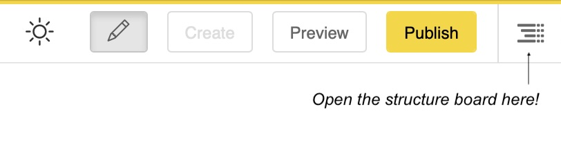
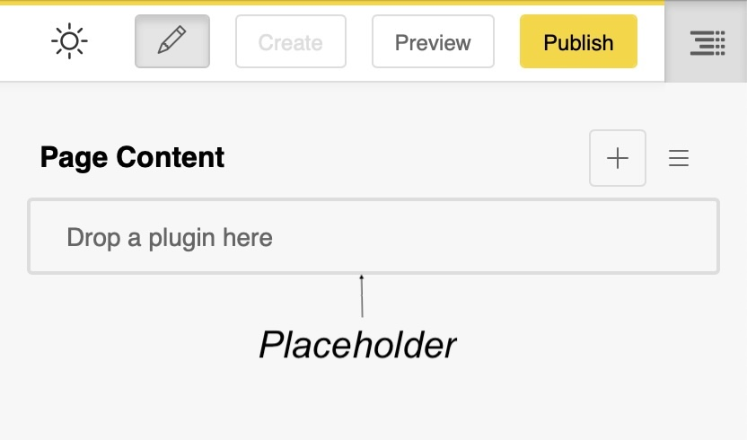
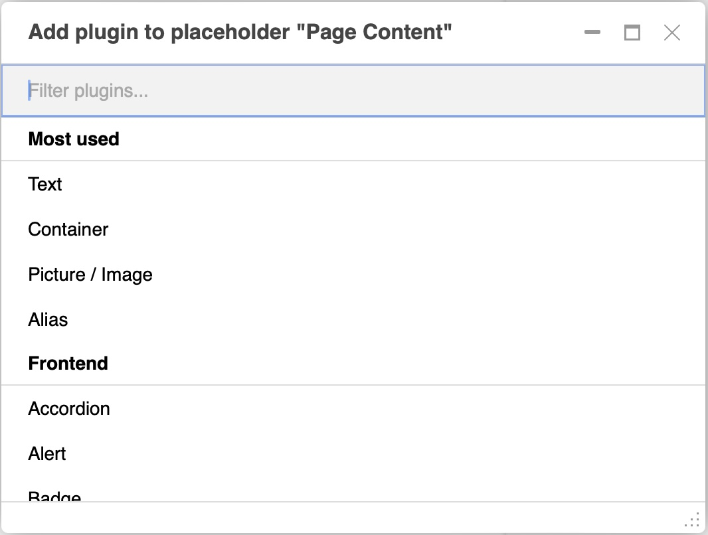
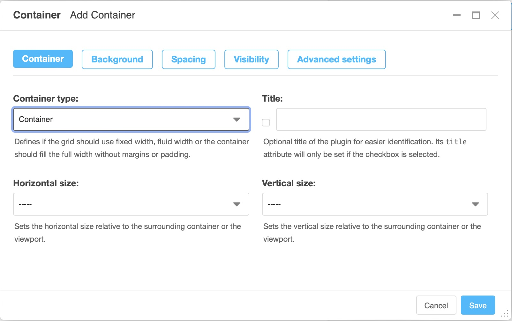
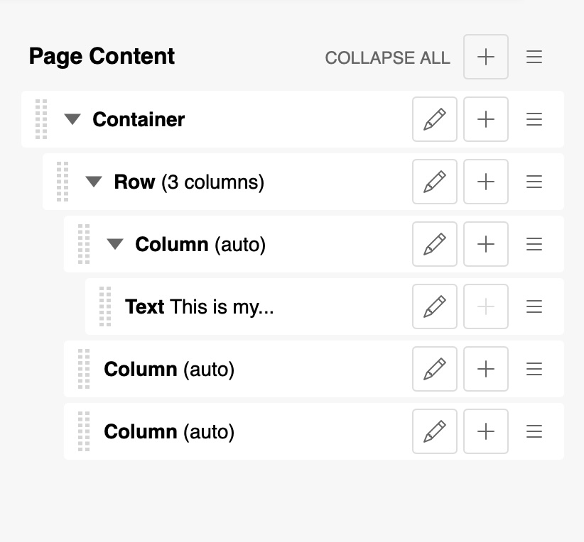
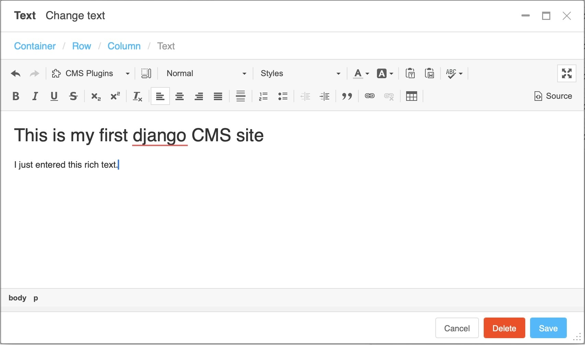
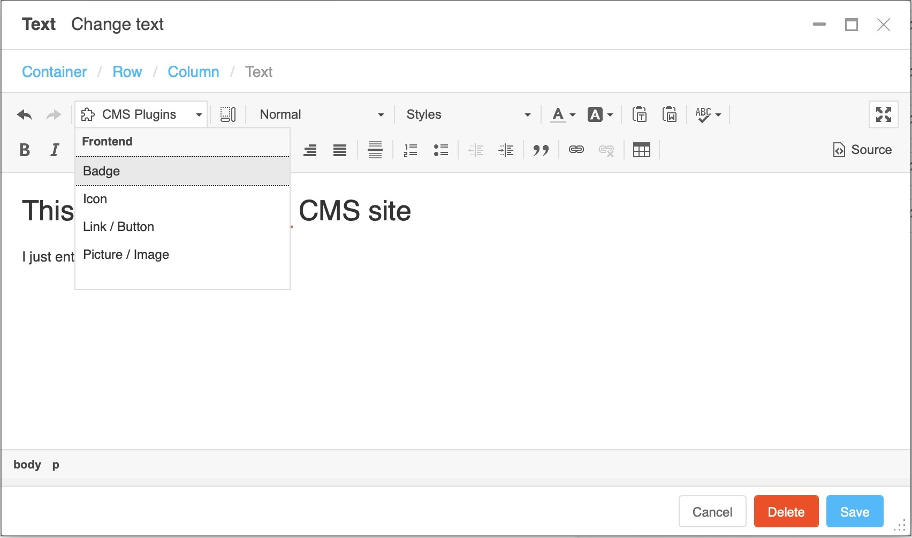

.. _plugins:

##################
Filling in content
##################

Now that you have created a place where your content can live, you can start filling in actual content. Like the page tree, content is structured in so called "plugins" which live in plugin trees inside placeholders.

Structure board
###############

Your page will have one or more placeholders to fill with content. They are displayed in the **structure board**.

To add plugins to your page (or alias, or blog), you need go to open the structure board by clicking the button on the far right side of the menu bar.

There are different types of plugins for adding content, each with a specific purpose. The ones you will mainly need are the "classic" rich text, image, video, link and button plugins.

.. note::

  Which plugins are available on your site strongly depends on the installation. Take this guide as a blueprint on how to interact with plugins. Even if you have different plugin options installed the editing process is always the same.

Once you have clicked on the structure board button, the structure board will open on the right side of your browser window. It will show one or more placeholders.

Adding plugins
##############

To add content to a page, click on the button . A dialog box will open, showing you the list of content you can add. Make your choice, a new dialog box opens.

Fill in the fields (in the container example below you do not have to fill any fields - all are optional), and save. The new content is displayed on your page.

.. note::

  The exact content of the add or edit plugin depends on the plugin itself. The container plugin in the example is one of many plugins provided by the django CMS Frontend package which are designed to structure your page.

  Those plugins do have a set of tabs (colored in blue) at the top of the dialog and offer a wide set of design options, most of which are optional.

Repeat the operation as many times as you want and for as much content as you want.

If you want to move content to arrange their layout, for example to move an image before or after text, use the "drag & drop" function of the CMS via the notch on the left of the content type.

You can also add content to change your layout; some of this content is nestable (you can put text in columns, which are themselves inserted in a section).

If this element allows the addition of nestable content, the add plugin button will be available at the same level as the module title. The triangle icon will appear next to the dotted line of the drag and drop button to show or hide the nested content:

.. tip::

  If you **hover** over the structure menu items while pressing the **SHIFT** key, the content displayed on the CMS page will be highlighted, so you can see what each plugin corresponds to.

Editing plugins
###############

You can change existing plugins by either

* **double clicking** on the content in the page (when in edit mode)
* **clicking the pencil icon** of the plugin in the structure board.

Editing works exactly like creating a plugin

Integrating content
###################

When you add content to your page, you may want to integrate text, a video, clickable buttons or links into your text.

Text
====

django CMS includes a rich text editor. Its interface is particularly simple, since it only consists of the text you want to enter:

.. tip::

  If your installation has inline editing enabled, you can even edit text right on the web page if the pencil button in the toolbar is activated:

  .. image:: ./images/07-inline-editing.jpg
    :alt: django CMS text inline editing

.. tip::

  All plugins show a few words of summary in the plugin tree. Those plugin trees can get huge, though. To keep an overview, use a feature of the Container plugin:

  The title field is a text field to briefly describe the container content. It will be displayed in the plugin tree. It is a good practice to use separate containers for different sections of your page and fill the title for quick navigation in the plugin tree.

Some plugins can even be added directly to a text plugin using the "CMS Plugins" menu within the text editor. This is useful for adding dynamic links to your text. Dynamic links are links to other pages of your site which - should the destination change its URL - will be automatically kept up-to-date.

.. warning::

  Would you like to see more content here, e.g. on images, videos, links and buttons? Please `join us on Slack <https://www.django-cms.org/slack>`_ and the Slack ``#workgroup-documentation`` to add content here.
