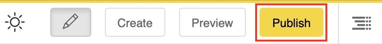
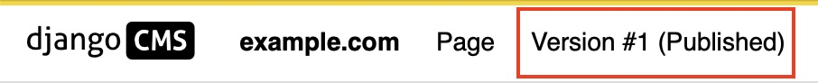
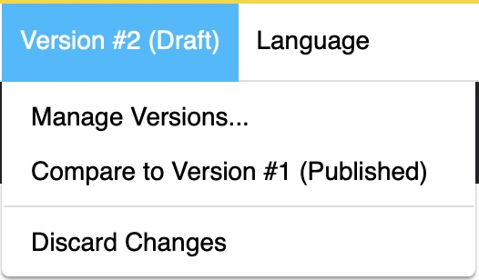
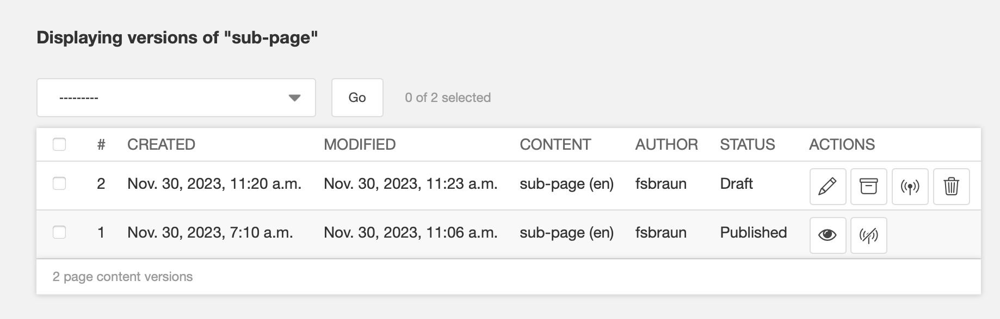
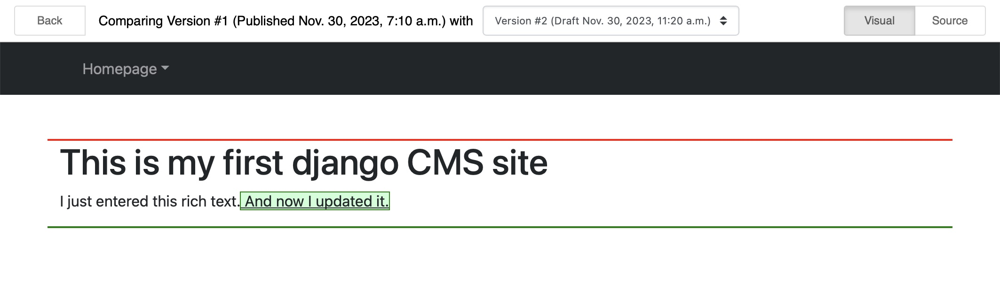

.. _publishing:

##################
Publishing content
##################

.. include:: ../versioning-note.include

Once you have finished filling in your newly created page (or blog post), it is saved as a draft. It will not be published until you decide to do so. As an editor, you can view drafts, but any site visitors will only see published pages.

To publish a page, click on the highlighted "Publish" button in the toolbar. This button is visible in the page's edit mode. (If there is a highlighted "Edit" button instead, click it first to get to edit mode.)

When published you will be taken to the published page or the "manage versions" dialog, depending on the setup of your site. If you're taken to the manage versions dialog, click on the eye button of the top listed version to get back to the page you just published.

You will see in the toolbar that the version menu now shows that the content is "published".

Version states
==============

Since django CMS 4, pages and other publishable content can have more than the two states "draft" and "published".

.. note::
  Versioning is managed by an optional package like django CMS Versioning. Your installation might manage versions differently. This guide assumes that django CMS Versioning is installed.

The **"published" state** marks the only version of the page that is currently visible to web site visitors.

The **"draft" state** of a page is the one which the editor can change.

Any version that has been published at any point in time will get the **"unpublished" state** once it is either unpublished manually or implicitly when another version of the page is published.

Versions in the **"archived" state** have not been published but retained by a user for later use.

.. figure:: /images/version-states.png
  :alt: Version states and the editing process

  This diagram summarizes the possible states and the actions which create a change in the state of a version.

Managing versions
=================

To manage versions of the currently displayed page, go to the Version menu and select "Manage Versions...":

This opens the sidebar with the manage versions dialog:

You will see (a potentially long) list of all versions created, ever. On the right side of the list you see the action buttons. You can

* **Pencil**: Go back to the **edit** view of a draft
* **Archive**: Archive a draft version for later re-use.
* **Antenna**: Publish a draft
* **Litter bin**: Delete a draft
* **Eye**: View an old version. Note: Those cannot be edited any more.
* **No-antenna**: Unpublish a currently public version
* **Undo**: Revert an archived or unpublished version into a new draft version

Comparing versions
==================

With many versions being available, it sometimes is difficult to keep track of changes. You can visually compare two versions by

* Either selecting two versions in the manage versions dialog and the choosing the "Compare versions" from the actions dropdown and hitting "Go".
* From the Version menu

An example of a visual comparison is shown here:

Added content is marked green, deleted content is marked red.

.. tip::

  If you want to see the changes in the generate HTML code you can select "Source" in the upper right of the compare view.

